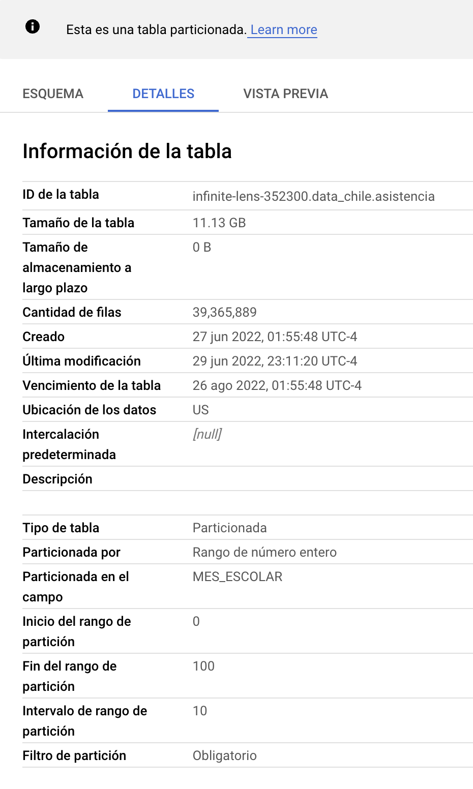

# 1- Características del dataset

La motivacion de este trabajo, es de poder obtener la informacion respecto de la asistencia de estudiantes de Chile, concretamente en el año 2019.

- año
- regiones
- comunas

La informacion para este procesamiento y tratamiento de datos, se obtiene desde el [informe de asistencia de MINEDUC](https://datosabiertos.mineduc.cl/asistencia-declarada-mensual-2/)

El tamaño de la carga del dataset es de 11.13 GB dentro de BigQuery

Algunas de las columnas de la tabla asistencia

