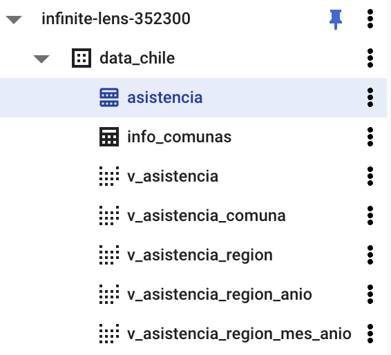

# 2 - Obtención y carga de datos

Seccion para la obtencion de datasets desde [informe de asistencia de MINEDUC](https://datosabiertos.mineduc.cl/asistencia-declarada-mensual-2/) y Carga de estos datasets en BigQuery 

**Tabla contenidos de seccion**

- [2.1 - Instalacion de UnRar en Google Cloud Shell](#2.1-Instalacion-de-UnRar-en-Google-Cloud-Shell)
- [2.2 - DDL de creacion de tabla ```asistencia``` en BigQuery](#2.2-DDL-de-creacion-de-tabla-asistencia-en-BigQuery)
- [2.3 - Descarga de datasets desde MINEDUC y Carga de archivos .csv en BigQuery](#2.3-Descarga-de-datasets-desde-MINEDUC-y-Carga de archivos-csv-en-BigQuery)


### 2.1 - Instalacion de UnRar en Google Cloud Shell

Se debe ejecutar los comandos provistos en el apartado, para poder descomprimir archivos ```*.rar``` dentro de Google Cloud Shell

```
wget https://www.rarlab.com/rar/rarlinux-x64-5.6.0.tar.gz
tar -zxvf rarlinux-x64-5.6.0.tar.gz
cd rar
sudo cp -v rar unrar /usr/local/bin/
```

### 2.2 - DDL de creacion de tabla ```asistencia``` en BigQuery

La tabla ```asistencia``` sera la encargada de poder albergar los datos obtenidos desde los datasets de asistencia de MINEDUC. 
Para la creacion de la tabla, se debe ejecutar la siguente sentencia DDL en el editor de BigQuery

``` bigquery
DROP TABLE `infinite-lens-352300.data_chile.asistencia`;

CREATE TABLE 
  `infinite-lens-352300.data_chile.asistencia` (
  AGNO INTEGER,
  MES_ESCOLAR INTEGER,
  RBD INTEGER,
  DGV_RBD INTEGER,
  NOM_RBD STRING,
  COD_REG_RBD INTEGER,
  NOM_REG_RBD_A STRING,
  COD_PRO_RBD INTEGER,
  COD_COM_RBD INTEGER,
  NOM_COM_RBD STRING,
  COD_DEPROV_RBD INTEGER,
  NOM_DEPROV_RBD STRING,
  RURAL_RBD INTEGER,
  COD_DEPE INTEGER,
  COD_DEPE2 STRING,
  COD_ENSE INTEGER,
  COD_ENSE2 INTEGER,
  COD_GRADO INTEGER,
  LET_CUR STRING,
  MRUN INTEGER,
  GEN_ALU INTEGER,
  FEC_NAC_ALU STRING,
  COD_COM_ALU INTEGER,
  NOM_COM_ALU STRING,
  DIAS_ASISTIDOS INTEGER,
  DIAS_TRABAJADOS INTEGER,
  ASIS_PROMEDIO FLOAT64
)
PARTITION BY  
  RANGE_BUCKET(MES_ESCOLAR, GENERATE_ARRAY(0, 100, 10))
OPTIONS(
  require_partition_filter=true
)
```

### 2.3 Descarga de datasets desde MINEDUC y Carga de archivos .csv en BigQuery

Para la descarga de los datasets, se genera una lista con la URL de los dataset escogidos y luego al procesar esta lista, se procesa la descarga y carga de archivos .csv a BigQuery, uno a uno. 
Esto con el fin de no sobrepasar la [cuota de almacenamiento](https://cloud.google.com/shell?hl=es) de Google Cloud Shell de 5GB.

Desde Google Cloud Shell, se debe ejecutar el siguente comando para iniciar la descarga de datasets y generar la carga de .csv en BigQuery:

``` commandline
python3 2/2-download_files.py
```
