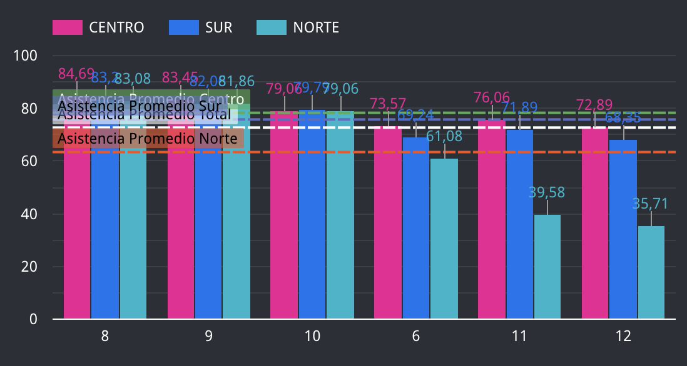

# 4 - Visualización de datos

El [panel de dataStudio](https://datastudio.google.com/reporting/c093ba5c-4a69-40c1-85fa-a0a4b3a1a62a/page/aGgwC) representa
la distribucion geografica de la asistencia promedio del segundo semestre del año 2019. 

### Mapa de Chile
En la primera vista, se muestra la comparación de la asistencia promedio total de cada región, el tamaño de la circunferencia
dimenciona la magnitud del promedio.


### Analisis de cada zona geográfica del país. 

El gráfico de barras muestra la evolución mes a mes 
de la asistencia promedio de cada zona, las lineas punteadas muestran los promedios totalizados.


### Analisis a nivel regional de cada zona
Donde podemos ver que regiones se desvian del promedio global de la zona. Para los meses 11 y 12, se observa
una mayor dispersión de la asistencia de cada región en torno al promedio de cada zona, en especial la zona norte, la cual 
posee la menor asistencia de las tres zonas para estos meses, siendo la región de Atacama  la que tiene una asistencia
promedio más baja. 


Para poder hacer los calclos del promedio de asistencia por region, se ocupa la formula:
``` 
AVG((CASE WHEN REGION_NOMBRE="REGION DE ANTOFAGASTA" WHEN PROMEDIO_ASISTENCIA END))
```
